# Demo Photos
## Basic GUI
The GUI has basic buttons as shown below.\
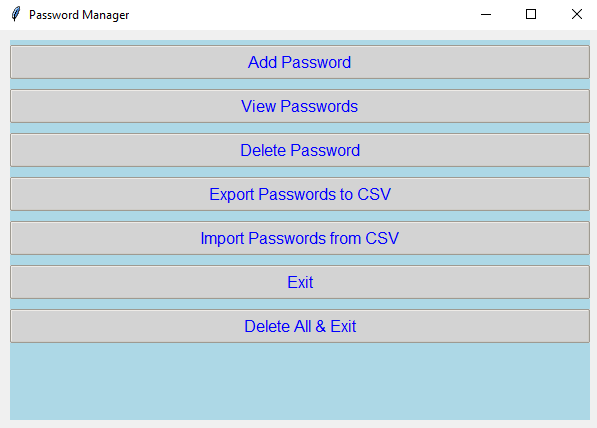
## Adding Password
When adding a password, you first enter the service name, then you choose from generating a password or adding your own.\
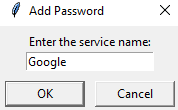\
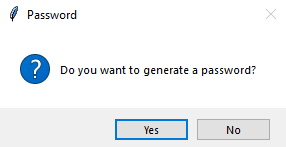
### Generating a Password
Password generation involves typing in the desired length, as well as deciding whether special characters should be included.\
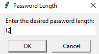\
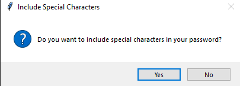\
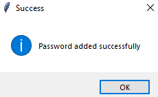
### Adding a Pre-Existing Password
Adding a pre-existing password just involves typing in the password that you want to save.\
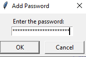\

## Deleting a Password
Deleting a password from the manager is easy, as you can go into the menu to view your passwords, select one to delete,
and click yes on the confirmation box.\
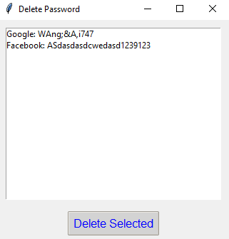\
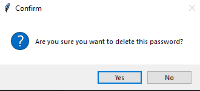
## View Passwords
By clicking view passwords, you can see the passwords you have saved in the manager\
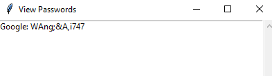

## Importing and Exporting to CSV
The secret key and passwords file has the ability to be sent to a CSV for importing on a different device\
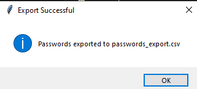\
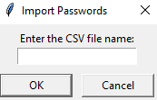

## Delete All and Exit
This deletes the passwords file completely, and exits the program.\
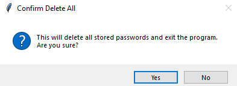